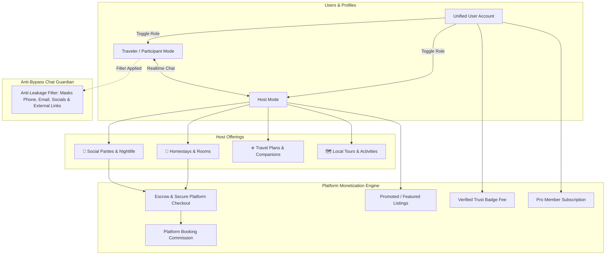

# Travel & Social Meetup Platform (Travel Buddy, Homestays & Meetups)

A community-driven social travel platform inspired by **BeATravelBuddy** and **Meetup**, connecting **Hosts** (parties, local events, travel companions, homestays) and **Participants/Travelers** looking to discover activities, join trips, find local stays, chat directly with hosts, and safely connect with verified people.

---

## User Review Required

> [!IMPORTANT]
> **Monetization & Anti-Bypass Architecture Approved Strategy**
> 1. **Zero-Leakage / Anti-Bypass Engine**:
>    - To safeguard revenue and user safety, communication remains inside the platform. Contact information (phone numbers, emails, external links, social handles, UPI/payment tags) is actively detected, masked, and blocked until a booking or verified connection is completed.
> 2. **Phased Low-Barrier Revenue Plan**:
>    - **Phase 1 (Penetration & Growth)**: Near-zero or nominal fees (e.g. flat micro-fee / 3% commission, free promotional listings) to maximize viral adoption and marketplace liquidity.
>    - **Phase 2 (Value Scaling)**: Tiered commissions (homestay bookings & paid party tickets), Promoted Listings, and "Verified Pro" memberships.
> 3. **Tech Stack**:
>    - **Next.js 15 (React 19 / TypeScript)**, **Tailwind CSS**, and **Supabase (PostgreSQL with RLS, Realtime Chat, Storage, Auth)**.

---

## Open Questions & Configuration Choices

> [!IMPORTANT]
> 1. **Initial Fee Threshold**:
>    - For the early launch phase, would you prefer a **flat micro-booking fee** (e.g., $1 / ₹49 - ₹99 per confirmed booking) or a **small % fee** (e.g., 2.5% - 3%)?
> 2. **Travel Buddy Free Tier**:
>    - For non-stay travel buddy meetups (e.g. "Visiting London Eye today at 4 PM"), should users have 3 free buddy requests per month before a micro-fee ($0.49 / ₹29), to keep buddy discovery friction-free while eliminating spam?

---

## 1. Platform Vision & Dual-Role Ecosystem

The platform connects verified hosts with global travelers across two primary operational modes:



---

## 2. Anti-Bypass & Anti-Disintermediation Engine

To prevent hosts and travelers from contacting each other outside the app and bypassing platform fees, the platform introduces a comprehensive **Platform Protection Shield**:

### 1. In-Chat Contact Masking & Regex Filter
- Real-time automated inspection of all direct chat messages before delivery.
- **Patterns Detected & Masked**:
  - Phone numbers (all international formats, spaced digits, spelled-out numbers like `nine-eight...`).
  - Email addresses (standard email format, obfuscated `user [at] gmail [dot] com`).
  - Social media handles & URLs (`@instagram`, `wa.me/`, WhatsApp, Telegram `t.me/`, Snapchat, Facebook, LinkedIn).
  - External payment handles (UPI IDs `@oksbi`, PayPal.me, CashApp `$cashtag`, Venmo).
  - External URLs and redirect links.
- **Replacement Behavior**:
  - Sensitive details replaced dynamically with:  
    `[Contact Info Protected - Coordinate safely through platform to preserve host & traveler guarantee]`
  - Educational prompt shown to both parties highlighting platform insurance, damage guarantee, and verified refund protection.

### 2. Post-Booking Contact Reveal (Escrow Unlock)
- Direct contact details (phone number, exact residential address, directions) are **strictly locked** until a booking is accepted and processed through the platform escrow.
- Once confirmed, both parties receive a **Booking Voucher** revealing emergency phone numbers and exact meet coordinates.

### 3. Incentives to Stay On-Platform
- **Host Protection & Deposit**: Damage guarantee and payout protection against traveler no-shows.
- **Traveler Refund Guarantee**: If the host cancels or the room/event is not as described, the traveler gets an immediate 100% refund.
- **Reputation & Review Building**: Verified reviews can only be earned through on-platform completed transactions, which directly boosts the host's rank.

---

## 3. Comprehensive Revenue Generation Model

### Phased Pricing Strategy: "Penetration to Value Scaling"

| Revenue Stream | Phase 1: Launch & Density (Early Stage) | Phase 2: Growth & Monetization | Phase 3: Maturity & Scale |
| :--- | :--- | :--- | :--- |
| **Homestay Bookings** | Flat token fee ($1 / ₹79 per booking) | 4% Host fee + 5% Guest service fee | 6% Host fee + 8% Guest service fee |
| **Paid Events & Parties** | 2.5% payment processing only | 5% ticket commission | 8% ticket commission + VIP upgrades |
| **Travel Buddy Connects** | 100% Free (Builds virality) | 3 Free connects/mo; then $0.99 unlock | Premium Buddy Matchmaker pass |
| **Featured Listings** | Free boost for first 100 hosts | $3 - $7 for 48-hr city feed pin | $9 - $19 targeted boost + city alerts |
| **KYC Verified Shield** | Free promotional verification | $1.99 / ₹149 one-time badge | Annual verified subscription ($9.99/yr) |
| **Platform Pro Tier** | N/A (Focus on adoption) | $4.99/mo (Zero fees, top visibility) | $9.99/mo (Host business tools, analytics) |

---

## 4. Multi-Tier Anti-Fake Profile & Safety Architecture

```
┌────────────────────────────────────────────────────────────────────────┐
│                        TRUST & VERIFICATION TIERS                      │
├────────────────────────────────────────────────────────────────────────┤
│ Tier 1: Phone & Email OTP     → Eliminates bot accounts & disposable emails│
│ Tier 2: Live Selfie Match     → Matches live photo with profile picture│
│ Tier 3: Official Gov ID / KYC → Passport / Driver's License verification│
│ Tier 4: Bilateral Reviews     → Mutual feedback after completed bookings│
└────────────────────────────────────────────────────────────────────────┘
```

- **Tier 1 (Phone & Email OTP)**: Mandatory for registering and initiating conversations.
- **Tier 2 (Live Selfie Liveness)**: Uses front camera capture to prevent catfishing and stock photo profiles.
- **Tier 3 (Government ID / KYC)**: Users submit proof of identity to obtain the **Gold Verified Shield**, unlocking higher booking trust and lower deposit requirements.
- **Tier 4 (Mutual Reviews & Demerit Score)**: Users who repeatedly attempt to bypass the platform or violate community guidelines receive penalties or account suspensions.

---

## 5. Technical Implementation Blueprint

### Components & Architecture

#### [NEW] [Navbar & Global Navigation](file:///f:/Antigravity/Rohit%20Website%20Project/src/components/layout/Navbar.tsx)
- Dual mode switcher: **"Explore as Traveler"** vs **"Host a Stay/Event"**.
- Global search with destination auto-complete (London, California, Bali, Paris, Tokyo, etc.).
- Notifications, Chat badge, and User Verification status.

#### [NEW] [Explore & Destination Feed](file:///f:/Antigravity/Rohit%20Website%20Project/src/app/explore/page.tsx)
- Multi-category filter tabs: 🏨 **Homestays**, 🎉 **Parties & Nightlife**, ✈️ **Travel Buddies**, 🗺️ **Local Tours**.
- Featured/Promoted listing banners with badge indicators.
- Cards displaying host trust badge, location, dates, price/free status, and spots remaining.

#### [NEW] [Listing Details & Booking Page](file:///f:/Antigravity/Rohit%20Website%20Project/src/app/listings/[id]/page.tsx)
- Photo gallery, detailed itinerary or stay description, house rules, and amenities.
- Host credentials card (Verification level, rating, review history).
- Price breakdown: Base price + low platform service fee + total.
- Direct actions: **"Inquire via Protected Chat"** and **"Request to Book / Join"**.

#### [NEW] [Host Creation Studio & Pricing Wizard](file:///f:/Antigravity/Rohit%20Website%20Project/src/app/host/create/page.tsx)
- Step-by-step listing wizard for each of the 4 listing types.
- Pricing selector (Free, Fixed Price, Split Cost) with transparent fee calculation preview.
- Optional add-on: "Boost listing to top of feed".

#### [NEW] [Protected Real-Time Chat & Contact Guardian](file:///f:/Antigravity/Rohit%20Website%20Project/src/app/messages/page.tsx)
- Split-screen messenger with active threads and conversation history.
- **Anti-Bypass Filter Middleware**: Real-time masking of numbers, emails, social handles, and external payment links.
- Context card of the listing pinned to the chat header.
- Booking action triggers directly inside the chat flow.

#### [NEW] [Trust & Verification Center](file:///f:/Antigravity/Rohit%20Website%20Project/src/app/profile/verification/page.tsx)
- Step-by-step verification portal: Phone OTP, live selfie capture, ID card / passport upload.
- Status progress tracker (Pending, Verified, Needs Resubmission).

#### [NEW] [Admin Moderation & Revenue Dashboard](file:///f:/Antigravity/Rohit%20Website%20Project/src/app/admin/page.tsx)
- Revenue analytics: Total platform volume, booking fees collected, active promoted listings.
- Anti-bypass audit log: View flagged messages attempting off-platform leakage.
- KYC moderation queue: Review and approve/reject submitted user IDs.

---

## 6. Verification Plan

### Automated Verification
- `npm run build`: Strict TypeScript type checking and Next.js static asset compilation.
- Anti-bypass regex unit test suite: Validate detection of disguised phone numbers (`+1-555...`, `five five five...`, `9 8 7 6 5 4 3 2 1 0`), emails (`test at gmail dot com`), and social URLs.

### Manual Verification
1. **Chat Leakage Test**: Attempt sending phone numbers, Instagram IDs, and WhatsApp links in chat; verify masking and warning alerts appear.
2. **Booking & Fee Flow**: Complete a simulated homestay booking; verify correct calculation of low platform fee.
3. **Verification Flow**: Complete phone and selfie submission; verify verified badge updates on host profile.
4. **Host Listing Flow**: Publish a new California stay and a London Eye travel companion post; verify both appear in destination feeds.
